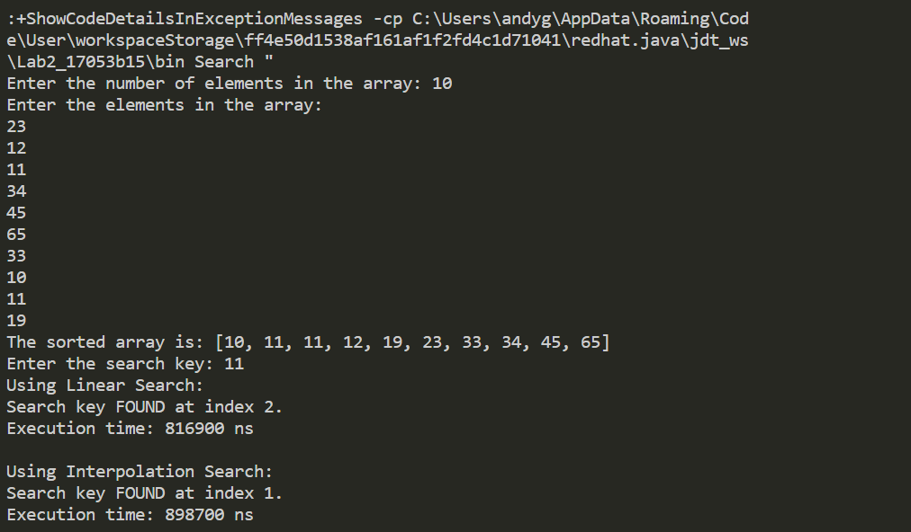
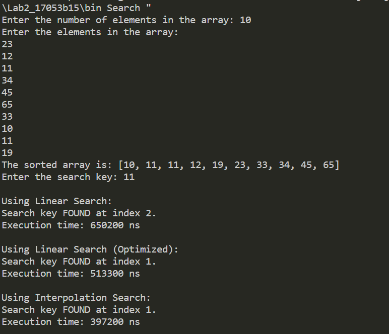

# Lab 2 Answers
Author: Andy Guevara
## Q1 & Q2
The implementation of the linear and interpolation search algorithms is present in `./src/Search.java`. The output of this section is the following:

## Q3
By simply breaking the for loop as soon as the array value matches the key value, the linear search algorithm effectivelly improves by 21% as shown below:

